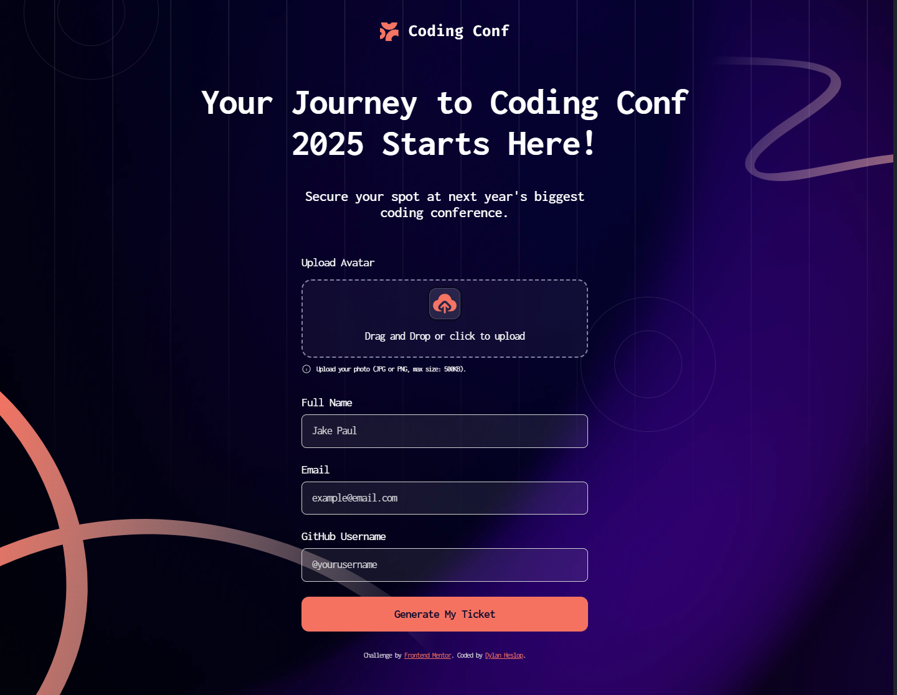

# Frontend Mentor - Conference ticket generator solution

This is a solution to the [Conference ticket generator challenge on Frontend Mentor](https://www.frontendmentor.io/challenges/conference-ticket-generator-oq5gFIU12w). Frontend Mentor challenges help you improve your coding skills by building realistic projects.

## Table of contents

- [Overview](#overview)
  - [The challenge](#the-challenge)
  - [Screenshot](#screenshot)
  - [Links](#links)
- [My process](#my-process)
  - [Built with](#built-with)
  - [What I learned](#what-i-learned)
  - [Continued development](#continued-development)
  - [Useful resources](#useful-resources)
- [Author](#author)

## Overview

### The challenge

Users should be able to:

- Complete the form with their details
- Receive form validation messages if:
  - Any field is missed
  - The email address is not formatted correctly
  - The avatar upload is too big or the wrong image format
- Complete the form only using their keyboard
- Have inputs, form field hints, and error messages announced on their screen reader
- See the generated conference ticket when they successfully submit the form
- View the optimal layout for the interface depending on their device's screen size
- See hover and focus states for all interactive elements on the page

### Screenshot



### Links

- Solution URL: [https://ticket-generator-fem.netlify.app](https://ticket-generator-fem.netlify.app)
- Live Site URL: [https://ticket-generator-fem.netlify.app](https://ticket-generator-fem.netlify.app)

## My process

### Built with

- Semantic HTML5 markup
- CSS custom properties
- Flexbox
- Mobile-first workflow
- SCSS Semantically Awesome StyleSheets
- Javascript

### What I learned

This was a rather interesting challenge, mainly due to the multiple background images, the drag and drop interface and working with the ticket svg background and making it responsive.

I learnt how to do a drag and drop interface(tho it could be improved), how to use `FileReader` to turn an uploaded image to a url which I can send to the other page or reuse and I also got to refresh my memory on how to preview an uploaded image.

```html
<div>
  <label for="avatar">Upload Avatar</label>
  <div id="image-drop" dropzone="link">
    <input
      type="file"
      name="avatar"
      id="avatar"
      class="avatar--input sr-only"
      required
    />
    <label class="drop--label" for="avatar">
      <div class="preview--container">
        
      </div>
      <p id="dragLabel">Drag and Drop or click to upload</p>
      <div class="active--image--btns">
        <button id="btnRemove" type="button">Remove Image</button>
        <button id="btnChange" type="button">Change Image</button>
      </div>
    </label>
  </div>
  <div id="image--upload--label" class="info--wrapper">
    <svg
      xmlns="http://www.w3.org/2000/svg"
      width="16"
      height="16"
      fill="none"
      viewBox="0 0 16 16"
    >
      <path
        class="error--red"
        stroke="#D1D0D5"
        stroke-linecap="round"
        stroke-linejoin="round"
        d="M2 8a6 6 0 1 0 12 0A6 6 0 0 0 2 8Z"
      />
      <path
        class="error--red"
        fill="#D1D0D5"
        d="M8.004 10.462V7.596ZM8 5.57v-.042Z"
      />
      <path
        class="error--red"
        stroke="#D1D0D5"
        stroke-linecap="round"
        stroke-linejoin="round"
        d="M8.004 10.462V7.596M8 5.569v-.042"
      />
    </svg>
    <p id="info--text">Upload your photo (JPG or PNG, max size: 500KB).</p>
  </div>
</div>
```

```scss
#image-drop {
  width: 100%;
  height: 126px;
  border-radius: 1rem;
  border: 2px dashed $neutral-500;
  margin-top: 1rem;
  background-color: rgba($neutral-500, 0.08);
  -webkit-backdrop-filter: blur(5px);
  backdrop-filter: blur(5px);
  padding: 0.75rem 1rem;
  cursor: pointer;
  transition: 150ms ease-in-out;

  &:hover {
    background-color: rgba($neutral-500, 0.2);
    cursor: pointer;

    .preview--container {
      border: 1px solid $neutral-500;
    }
  }

  .drop--label {
    text-align: center;
    font-size: 18px;
    letter-spacing: 0;
    cursor: pointer;
  }
}
```

```js
imageDrop.addEventListener("drop", handleDrop, false);

function handleDrop(e) {
  const dt = e.dataTransfer;
  const files = dt.files;

  if (files && files.length > 0) {
    handleFiles(files);

    // Create a new DataTransfer to set the files on the input
    const dataTransfer = new DataTransfer();
    for (let file of files) {
      dataTransfer.items.add(file);
    }
    avatarInput.files = dataTransfer.files;
  } else {
    console.error("Dropped items are not files.");
  }
}

function handleFiles(files) {
  let file = files[0];
  createPreview(file);
}

function createPreview(file) {
  let objectURL = URL.createObjectURL(file);
  imagePreview.src = objectURL;
  dragLabel.style.display = "none";
  activeBtns.style.display = "flex";

  if (!btnChange || !btnRemove) {
    btnChange = document.getElementById("btnChange");
    btnRemove = document.getElementById("btnRemove");

    btnChange.addEventListener("click", changeImage);
    btnRemove.addEventListener("click", removeImage);
  }
}
```

### Continued development

There are a few things I would like to do to improve this project on a later date.

1. Improve JS code: The JS code could be better and I could make more efficient and use less lines I think.
2. I'm thinking of adding a download ticket button that downloads the tcket as a png file, I have used a library to do something similar before, so I don't think it will take long.
3. My SCSS could be better, I have used it in the past but not much recently so I probably need to relearn how to use mixins and make my code shorter.
4. I also would like to make it more accessible in terms of `aria-*` attributes.

### Useful resources

- [CSS TRICKS - Drag and Drop](https://css-tricks.com/drag-and-drop-file-uploading/) - This helped me for XYZ reason. I really liked this pattern and will use it going forward.
- [SCS - Doccumentation](https://sass-lang.com/) - This is an amazing article which helped me finally understand XYZ. I'd recommend it to anyone still learning this concept.

## Author

- Website - [Dylan Heslop](https://linkedin.com/heslopd23)
- Frontend Mentor - [@yourusername](https://www.frontendmentor.io/profile/dylan-dot-c)
